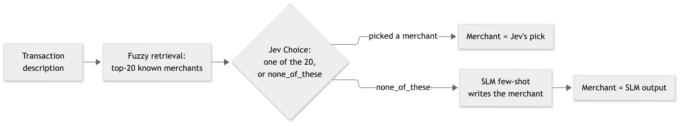

# Tranx: Transaction Standardization with Small Language Models

Tranx turns noisy bank transaction descriptions into **direction**, **category** and
**canonical merchant**, then rolls up per-customer spend by merchant. A customer can then
see one total for McDonald's or BP across lines like `McDonald's #111`,
`SQ *MCDONALDS F1234 ATLANTA GA` and `BP on Buford Hwy`.

Four method families are compared under one evaluation harness: fuzzy rules, sentence
embeddings, a local small language model (SLM) prompted few-shot, and TypeSafe's hosted
Jev model.

## Results in brief

- **Known merchants:** Jev picks the right merchant from a known list most often (0.98 on
  the synthetic feed, 0.96 on real UK statements), ahead of embeddings (0.96 / 0.88).
- **New merchants:** only the SLM can name a merchant that is not on the list (0.89 on
  brand-disjoint synthetic merchants). List-bound methods score 0 there by construction.
- **Category:** with labelled training data and familiar merchants, embeddings plus
  logistic regression are best (0.94). On new brands, Jev is best without any training
  (0.88 vs SLM 0.79, embeddings 0.64).
- **Combining them:** let Jev pick from the known list and send its "none of these"
  answers to the SLM. On real statements this is the most accurate setup (0.85 vs SLM
  alone 0.80). It depends on a clean list: when the list holds generic entries such as
  "Pharmacy" or "Internet Provider", or a parent brand such as "Hilton", Jev files some
  new merchants under them instead of answering "none of these".

All numbers below come from `reports/`. Synthetic results use 1000 eval rows per split;
95% intervals are merchant-cluster bootstrap half-widths from `reports/leaderboard_hard_jev.md`.

## Data and labels

| Source | What it is | Labels | Used for |
|---|---|---|---|
| Synthetic hard feed | 100k transactions built from the public HF dataset `mitulshah/transaction-categorization`, with customers, amounts, payment methods, noisy MCCs, and card-network-style dirty descriptors | Silver: merchant derived from the clean source description; category from the source | Main leaderboard, both splits |
| MoneyData (real) | One person's anonymized UK bank statements, 2015-2022 ([Firat et al. 2023](https://github.com/thevisgroup/MoneyVis)); 547 card and direct-debit descriptors, 3,521 rows | Merchant labels drafted by an LLM, then audited by a second model; **not human-verified**; alias table for legitimate alternative names | Merchant normalization on real noise |
| DoDataThings v2 | Independently generated synthetic US descriptors, 17 categories ([HF](https://huggingface.co/datasets/DoDataThings/us-bank-transaction-categories-v2)) | Category only | Category on noise that Tranx's own generator did not produce |

**Merchant-less rows.** About 25% of synthetic rows have no merchant: transaction types
(salary, transfer, loan, donation, fees) and labels that name what was bought rather than
who was paid (MRI, Toll, Broadband, Insurance). They are scored for category only.
Unnamed providers and venues (Hospital, Pharmacy, Cable Company, Gym) remain merchants.

**Splits.** `random` shares merchants between train and eval. `unseen` holds out whole
brand families by a stable hash, so no eval brand, and no sibling label such as Walmart
for Walmart Pharmacy, appears in training. For MoneyData the equivalent is a realistic
merchant list: merchants seen in at least two descriptors are on the list, and the 202
merchants seen once count as new.

## Routes

| Route | Merchant | Category | Needs | ms/txn |
|---|---|---|---|---|
| `rules` | rapidfuzz match against the training merchant list; falls back to cleaned text | MCC and merchant priors learned from training data | labelled training rows | 0.1 |
| `embedding` | nearest merchant name by MiniLM cosine similarity | logistic regression on description embeddings | merchant list; labelled rows for category | 7 |
| `slm_fewshot` | Qwen2.5-3B (Ollama) reads the description and writes the merchant | same prompt | nothing trained; runs locally | 440-500 |
| `jev_merchant` | Jev chooses among the fuzzy top-20 known merchants or `none_of_these` (then cleaned text) | Jev chooses one of the categories | merchant list; `TYPESAFE_API_KEY` | 340 |
| `jev_slm` | as `jev_merchant`, but `none_of_these` goes to the SLM | Jev | both | 440-780 |

Jev is TypeSafe's hosted "System One" model: it answers typed questions (here a Choice
over named options) with a probability per option and a confidence score, and never
writes free text. `rules` sees the description and MCC; the other four routes see the
description only. Latency is serial, one request at a time, on an Apple Silicon laptop;
Jev's figure is mostly the network round trip.

## Results

### Synthetic hard feed

`reports/leaderboard_hard_jev.md`, category / merchant (normalized match):

| Route | random: category | random: merchant | unseen: category | unseen: merchant |
|---|---|---|---|---|
| rules | 0.79 | 0.77 | 0.55 | 0.25\* |
| embedding | **0.94** | 0.96 | 0.64 | 0.00 |
| slm_fewshot | 0.76 | 0.90 | 0.79 | **0.89** |
| jev_merchant | 0.85 | **0.98** | **0.88** | 0.26\* |
| jev_slm | 0.85 | **0.98** | 0.87 | 0.81 |

\* Fallback artifact. When no known merchant matches, `rules` and `jev_merchant` output
the cleaned description, and the silver label was produced by the same cleaning function.
These cells do not measure generalization.

Unseen-split intervals are wide (category ±0.05 to ±0.09, merchant up to ±0.08) because
the held-out set covers only 67 merchants. A category guesser that never reads the
description (type code, MCC and amount magnitude) scores 0.68, so category gains should be
read against that baseline rather than against chance.

### Jev as a gate for new merchants

On brand-disjoint unseen merchants, Jev answered `none_of_these` for 87.3% of rows and
matched the other 12.7% to a known label, mostly a generic provider type (CVS to
"Pharmacy", State Police to "Police Department", Windstream to "Internet Provider"). That
is why `jev_slm` (0.81) trails the SLM alone (0.89) on the unseen split.

Jev's confidence mostly separates its right and wrong picks
(`reports/jev_confidence_summary.json`): the probability that a right pick has higher
confidence than a wrong one (AUROC) is 0.98 on the synthetic random split and 0.93 to 1.00
on MoneyData, and right picks have a median confidence of 1.00. The wrong picks that
remain are ones Jev is sure about. On MoneyData's realistic list they are sub-brands
matched to a parent (DoubleTree by Hilton to "Hilton", Uber Eats to "Uber") at confidence
0.98 to 0.99. So a confidence threshold narrows the gap but does not close it
(`reports/jev_threshold_cascade.json`):

| Merchant accuracy of the Jev to SLM cascade | no threshold | threshold 0.95 | SLM only |
|---|---|---|---|
| Synthetic, known merchants (random) | 0.985 | 0.957 | 0.899 |
| Synthetic, new merchants (unseen) | 0.803 | 0.873 | 0.893 |
| MoneyData, realistic list | 0.850 | 0.834 | 0.804 |

For a mix of 80% known and 20% new merchants on the synthetic feed, no threshold and a
threshold of 0.7 tie at 0.949.

### Real UK statements (MoneyData)

`reports/real/moneydata_summary_high-medium_aliased.json`, merchant accuracy per
descriptor:

| Setting | fuzzy | embedding | SLM | Jev | Jev, none to SLM |
|---|---|---|---|---|---|
| Every merchant on the list | 0.87 | 0.88 | 0.80 | **0.96** | |
| Realistic list (one-off merchants are new) | 0.60 | 0.55 | 0.80 | 0.62 | **0.85** |

With the realistic list, Jev answered `none_of_these` for 95.5% of descriptors whose
merchant was off the list and for 1.7% of those on it. On the off-list merchants alone the
SLM gets 0.65. Amazon is 34% of rows, so row-weighted scores lean on one brand. Averaged
per merchant instead, the realistic-list scores fall to 0.70 or below, because most
merchants in one person's statements appear only once.

### Category on an independent generator (DoDataThings v2)

`reports/real/ddt_summary.json`, 1000 test descriptions after removing duplicates shared
with training, 17 categories:

| embedding (trained on this dataset) | Jev (zero-shot) | SLM (zero-shot) |
|---|---|---|
| **0.90** | 0.81 | 0.62 |

The SLM returned an unparseable or off-list category for 31 of the 1000 rows.

## How to choose

Which method to use for the merchant depends mostly on whether the merchant is already on
your list:


For the category, the deciding questions are whether you have labelled data and whether
the merchants are familiar:


The cascade used for mixed traffic lets Jev pick from the list first and hands its "none
of these" answers to the SLM:



| Traffic | Sent to the SLM | Cascade accuracy | SLM alone | Source |
|---|---|---|---|---|
| Known merchants (synthetic random) | 1.2% | 0.98 | 0.90 | `leaderboard_hard_jev.md` |
| New merchants (synthetic unseen) | 87.5% | 0.81 | 0.89 | `leaderboard_hard_jev.md` |
| Real statements, realistic list | 36% | 0.85 | 0.80 | `real/moneydata_summary_high-medium_aliased.json` |

The cascade is only as good as Jev's "not on the list" answer. On a clean brand-only list
it is reliable; with generic entries or parent brands on the list, some new merchants are
filed under them. The SLM is about 60 times slower than embeddings, so it fits a batch or
fallback tier rather than every transaction. Diagram sources are in `docs/diagrams/`
(Mermaid).

## Evaluation controls and caveats

- **Synthetic data, silver labels.** The main feed and its merchant labels are generated.
  The labels were audited on 2026-09-27: template suffixes that split one brand into
  several labels were removed, merged and split names were fixed, merchant-less rows were
  introduced, and the synthetic type code no longer encodes the category. Results before
  that date are not comparable.
- **Cleaner vs generator.** The description cleaner and the generator share part of their
  noise vocabulary (processor prefixes), so the synthetic feed is kinder to string
  cleaning than real statements are. MoneyData and DoDataThings exist to check that.
- **Real-data labels** were drafted and audited by models, not by a person, and MoneyData
  is a single person's statements.
- **Direction** is recoverable from the amount sign by construction and is not used to
  compare routes.
- **Run-to-run variance.** The SLM varies by about ±1 point between runs (Ollama on GPU is
  not bit-deterministic at temperature 0).

## Quickstart

```bash
python3.11 -m venv .venv && source .venv/bin/activate
pip install -r requirements.txt
huggingface-cli login              # accept the dataset terms on its HF page first
ollama pull qwen2.5:3b-instruct
./run.sh                           # tests, hard-mode synth, leaderboard; TRANX_N=5000 ./run.sh for a quick pass
```

`run.sh` scores the three local routes into `reports/leaderboard_hard.md`. With
`TYPESAFE_API_KEY` set it also scores the Jev routes into `reports/leaderboard_hard_jev.md`.

The external evaluations live in `scripts/` (`eval_moneydata.py`, `eval_ddt.py`,
`jev_confidence.py`, `jev_threshold_cascade.py`). MoneyData's raw file, labels and aliases
are kept locally under `data/real/` and are not in this repository, because the source
repository carries no licence and the labels are unverified; the scripts expect those
files to exist.

## History

An earlier version compared a LoRA fine-tune of the same SLM (`slm_lora`) and reported
results on a standard (clean) feed. Both predate the label audit and are no longer
maintained; `reports/leaderboard.md` and `docs/findings/` are kept as history.
