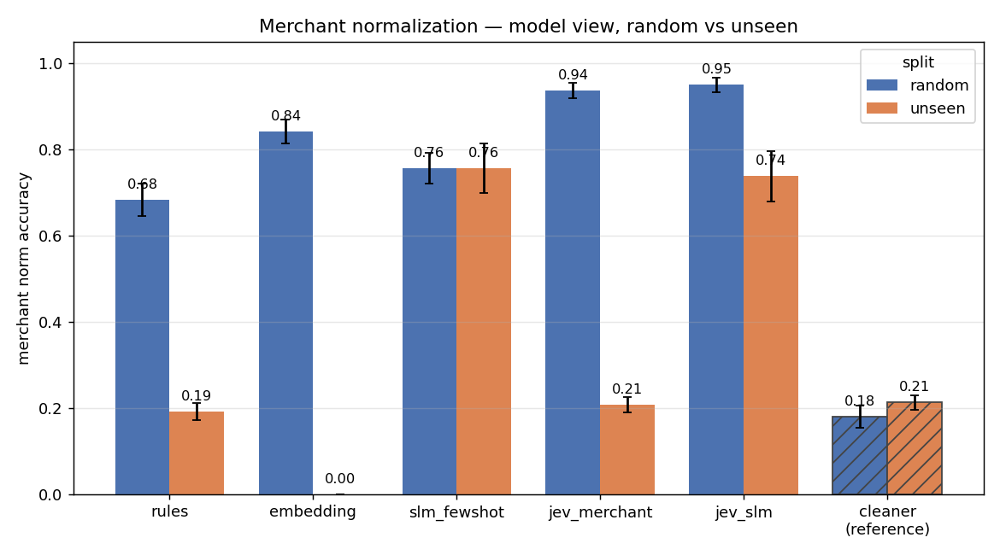
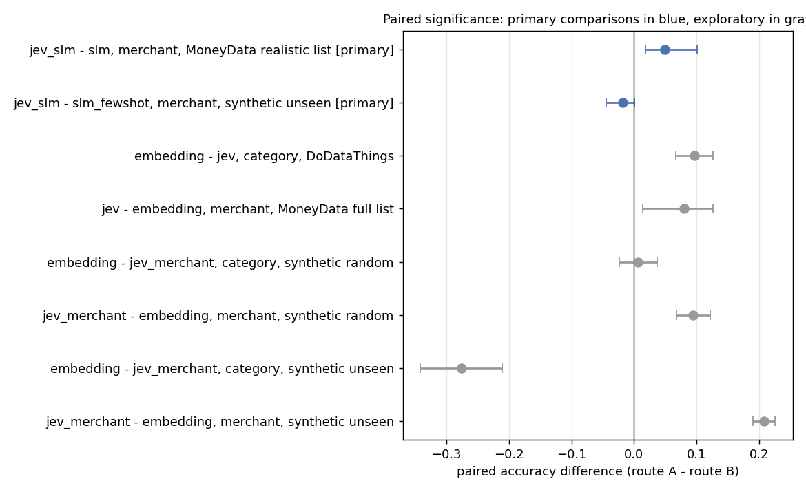
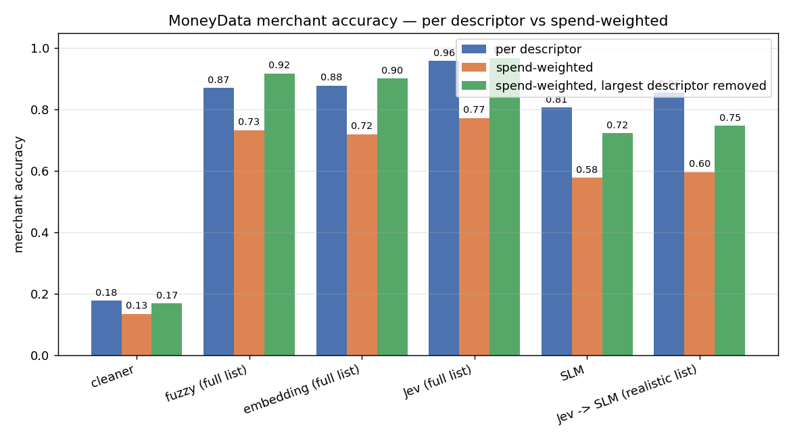

# Tranx: Transaction Standardization with Small Language Models

Tranx turns noisy bank transaction descriptions into **direction**, **category** and
**canonical merchant**, then rolls up per-customer spend by merchant. A customer can then
see one total for McDonald's or BP across lines like `McDonald's #111`,
`SQ *MCDONALDS F1234 ATLANTA GA` and `BP on Buford Hwy`.

Four method families are compared under one evaluation harness: fuzzy rules, sentence
embeddings, a local small language model (SLM) prompted few-shot, and TypeSafe's hosted
Jev model. Two baselines anchor them: string cleaning alone, and a category guess from
metadata alone.

## How each method works

Every method receives one transaction: the bank's description string plus metadata
(amount, a type code, sometimes an MCC merchant category code). Direction (money in or
out) is the sign of the amount for all of them. What differs is which inputs each method
reads, what it is given from upstream, and what it can return.

**Shared upstream steps** (`tranx/pipeline/clean.py`, `tranx/synth/canonical.py`):

- *Prefix strip*: remove a leading payment-processor wrapper (`SQ *`, `TST*`, `PP*`,
  `PAYPAL *`, `SP *`, `POS DEBIT`, `PURCHASE`, `ACH`) so the real merchant is at the front.
- *Cleaning* (`derive_canonical`): drop store and transaction ids (`#4521`), countries,
  time phrases and location words (Store, Mall, Airport), and extra spaces. City and
  state tokens (`ATLANTA GA`) stay; the fuzzy matchers below tolerate them. It cannot undo
  abbreviation (`BLUE HRN BKRY`), truncation or run-together words.
- *Known merchant list*: the merchant names that appear in the labelled training rows.
  The list-bound methods can only return a name from it.
- In the recommended design an exact-descriptor cache sits in front of all of this; the
  harness scores the methods only on descriptors the cache has not seen.

| Method | Reads | Upstream it relies on | Returns | Main limit |
|---|---|---|---|---|
| `cleaner` (baseline) | description | prefix strip, cleaning | the cleaned text as the merchant; no category | text is not a canonical name |
| `metadata` (baseline) | type code, MCC, amount | labelled rows | category only | no description, no merchant |
| `rules` | description, MCC | cleaning, known list, labelled rows | best fuzzy match or the cleaned text; category from MCC or merchant priors | new merchants fall back to the cleaned text |
| `embedding` | description | cleaning, known list, labelled rows | nearest known name; category from a trained classifier | cannot say "not on the list"; category fails on new brands |
| `slm_fewshot` | description | prefix strip | a merchant name it writes itself; a category | relies on what the model already knows; slow |
| `jev_merchant` | description | prefix strip, cleaning, known list (top 20) | one of the 20 candidates or "none of these"; a category | names only listed merchants; hosted API |
| `jev_slm` | description | all of the above | Jev's pick, else the SLM's name; Jev's category | inherits both sets of limits |

### `cleaner` (baseline)

- **Input:** the description.
- **How:** prefix strip, then cleaning; the result is the merchant. No category.
- **Why it is here:** it is the floor. Any merchant score at or near it (0.18 random, 0.21
  unseen on the synthetic model view) means the method added nothing beyond string cleanup.

### `metadata` (baseline)

- **Input:** type code, MCC (or "none" when absent) and amount. It never reads the
  description.
- **How:** one-hot type code and MCC plus log amount, into a logistic regression trained
  on the labelled rows (`tranx/routes/metadata.py`).
- **Output:** category only.
- **Limits:** needs labelled data. In the synthetic feed 60% of merchant rows carry an
  MCC and 85% of those point to the right category (`MCC_COVERAGE`, `MCC_NOISE` in
  `tranx/config.py`), which is cleaner than real MCCs, so its 0.69 is optimistic.

### `rules`

- **Input:** the description and the MCC.
- **Merchant:** prefix strip and cleaning, then rapidfuzz `token_set_ratio` against the
  cleaned known names. A match scoring 85 or more returns that known name; otherwise the
  cleaned text (`no_match_rate` in the leaderboard counts these).
- **Category:** the most common category for that MCC in the training rows; without an
  MCC, the most common category for the matched merchant; otherwise the most common
  category overall.
- **Limits:** a new merchant always falls back to the cleaned text (94% no-match on the
  unseen split), and category needs an MCC or a known merchant.

### `embedding`

- **Input:** the description.
- **Merchant:** the cleaned text and every known name are embedded with MiniLM
  (`all-MiniLM-L6-v2`); the known name with the highest cosine similarity is returned.
  It always returns some known name.
- **Category:** the raw description is embedded and passed to a logistic regression
  trained on the labelled rows.
- **Limits:** it cannot answer "not on the list", so new merchants score 0, and its
  similarity is a weak signal for "new": on MoneyData a 0.7 threshold sends 67% of
  descriptors onward to catch the new ones. The category classifier learns the brands it
  was trained on; on new brands it drops to 0.55, below the metadata baseline.
- **Speed:** about 6.5 ms per transaction on a laptop CPU, no network.

### `slm_fewshot`

- **Input:** the description after the prefix strip.
- **How:** a prompt with instructions, the allowed category names and five worked examples
  (`SQ *CANES 47486` becomes Raising Cane's), sent to Qwen2.5-3B-Instruct through a local
  Ollama server at temperature 0. The model replies with JSON: `canonical_merchant` and
  `category` (`tranx/routes/slm_fewshot.py`).
- **Fallbacks:** an unparseable reply gives the cleaned text as the merchant; a category
  not on the list becomes the most common training category.
- **Output:** a merchant name it writes itself, so it can name merchants that are on no
  list.
- **Limits:** it works from what the model already knows: 0.83 on national brands, 0.50
  on fictional local names, 0.19 when the name is abbreviated (unseen split). Its spelling
  of a name can differ from the canonical one (0.49 exact vs 0.76 after normalizing case
  and punctuation). About 460-510 ms per transaction locally; 31 of 1000 DoDataThings rows
  got an invalid category.

### `jev_merchant` (TypeSafe Jev)

Jev is TypeSafe's hosted "System One" model. It answers typed questions about a state
object: here, Choice questions over named options. For each question it returns the chosen
option, a probability per option and a confidence score. It never writes free text.

- **Input:** only the description after the prefix strip. Amount, type code and MCC are
  withheld, because in the synthetic feed they are generated from the category and would
  hand Jev part of the answer.
- **Upstream:** fuzzy retrieval (`token_set_ratio` on cleaned text) picks the 20 known
  merchants closest to the description.
- **Request** (`tranx/routes/jev.py`, one API call per transaction), two questions:
  - *category*: choose one of the category names;
  - *merchant*: choose one of the 20 candidates, or `none_of_these` ("None of the listed
    merchants is the one in the description").
- **Output:** merchant = Jev's pick; on `none_of_these`, the cleaned text. Category = Jev's
  pick.
- **Limits:**
  - It can only name a merchant that retrieval put in the 20 (the right one is there for
    95% of known-merchant cache misses).
  - On new merchants it answered `none_of_these` for 96.4% but picked a known name for
    3.6%, mostly a similar-sounding one (Marshals for Marshalls, Mount Sinai for
    Cedars-Sinai), at middling confidence (median 0.58).
  - When a new merchant is a sub-brand whose parent is on the list, it picks the parent
    (DoubleTree by Hilton to Hilton on MoneyData); with the sub-brand on the list it picks
    the sub-brand. Parent answers count as correct under the scoring rule below.
  - Each transaction is a network call (about 360 ms serially, 641 input tokens) and the
    description leaves the bank.

### `jev_slm` (the cascade)

- **How:** exactly `jev_merchant`, except that a `none_of_these` answer sends the
  description to `slm_fewshot`, whose merchant name is used. The category stays Jev's.
- **Limits:** Jev's wrong picks never reach the SLM, and the SLM's own limits
  apply to everything that does. Whether the combination beats the SLM alone depends on
  the data (see Results in brief).

On the real datasets the same methods run through `scripts/eval_moneydata.py` (merchant
only; MoneyData has no category labels) and `scripts/eval_ddt.py` (category only;
DoDataThings has no merchant labels).

## Results in brief

- **Most transactions need no model.** A bank sees the same descriptor again and again.
  In one person's real statements 730 distinct descriptors cover 4,043 debit rows (18%);
  a descriptor cache answers the rest. Models only matter for cache misses, and every
  synthetic score below is measured on cache misses.
- **Known merchants:** Jev picks the right merchant from a known list most often (0.94 on
  synthetic cache misses, 0.96 on real UK statements), ahead of embeddings (0.84 / 0.88).
- **New merchants:** only the SLM can name a merchant that is not on the list (0.76 on
  brand-disjoint synthetic merchants). It is much better on well-known brands (0.83) than
  on fictional local shops (0.50) and on the one-off merchants of real statements (0.66).
- **Category:** on new brands Jev is best without any training (0.83, embeddings 0.55,
  metadata alone 0.69). With labelled data and familiar merchants, embeddings plus
  logistic regression tie with Jev on synthetic cache misses and beat it on an independent
  dataset (0.90 vs 0.81). Switching between them row by row, using Jev's merchant answer,
  does not beat Jev alone.
- **Combining them** (Jev picks from the list, its "none of these" answers go to the SLM)
  is the pre-set primary comparison. On real statements the cascade beats the SLM alone
  (+0.049, 95% CI +0.019 to +0.101). On synthetic new merchants it does not (-0.018, CI
  -0.045 to +0.001): Jev files 3.6% of them under a similar-sounding known name. It is
  worth it when most traffic is known merchants and the list holds brands only.

Every number below comes from a file in `reports/`, produced by one run whose inputs are
pinned in `reports/run/` (see [Reproducing](#reproducing)).

## Data and labels

| Source | What it is | Labels | Used for |
|---|---|---|---|
| Synthetic hard feed | 100k transactions built from the public HF dataset `mitulshah/transaction-categorization`, with customers, amounts, payment methods, noisy MCCs, card-network-style dirty descriptors, fictional local merchants and repeat visits | Silver: merchant from the clean source description or the fictional name; category from the source | Main leaderboard, both splits |
| MoneyData (real) | One person's anonymized UK bank statements, 2015-2022 ([Firat et al. 2023](https://github.com/thevisgroup/MoneyVis)); 547 labelled card and direct-debit descriptors, 3,521 rows | Merchant labels drafted by an LLM, audited by a second model; **not human-verified**; alias table for legitimate alternative names | Merchant normalization on real noise |
| DoDataThings v2 | Independently generated synthetic US descriptors, 17 categories ([HF](https://huggingface.co/datasets/DoDataThings/us-bank-transaction-categories-v2)) | Category only | Category on noise that Tranx's own generator did not produce |

**What the generator adds** (`tranx/synth/`, settings in `tranx/config.py`):

- **Fictional local merchants.** A stable-hash quarter of merchant rows in eight
  categories moves to 800 invented local names ("Rustic Stag Bookshop", "Kingsbury
  Physiotherapy") that share no word with any source label; 13,152 of 57,791 merchant
  rows end up local (`reports/run/synth_stats.json`). The source merchants are mostly
  national chains the SLM saw in pretraining; the locals test recovering a name the model
  has never seen.
- **Abbreviation.** 15% of descriptors drop interior vowels (`BLUE HERON BAKERY` becomes
  `BLUE HRN BKRY`). For a fictional name the full name is then not in the input, so those
  rows are left out of the headline merchant score and reported separately.
- **Repeat visits.** Each merchant has a number of locations that grows with its row
  count, each location has one fixed descriptor, and visits favour a few locations.
  This gives 0.156 distinct descriptors per row; MoneyData has 0.181 over all debit rows
  and 0.155 over its labelled descriptors (`counts` in
  `reports/real/moneydata_summary_high-medium_aliased.json`). Both the local share and the
  repeat rate are generator parameters, not findings.

**Merchant-less rows.** 42% of synthetic rows have no merchant and are scored for category
only: transaction types (salary, transfer, loan, donation, fees), labels that name what
was bought rather than who was paid (MRI, Toll, Broadband), and 79 labels that name a kind
of place or provider rather than an organization (Pharmacy, Police Department, Hospital,
Gym; `GENERIC_PROVIDER_LABELS` in `tranx/config.py`). A rollup of "Pharmacy" would merge
unrelated pharmacies, and on the known list such entries attract new merchants. Named
organizations stay merchants (IRS, DMV, Post Office, Children's Hospital).

**Parent brands.** A merchant answer that names the gold merchant's parent brand counts
as correct when both are the same kind of business (DoubleTree by Hilton and Hilton), or
when the row's category was also predicted right (Walmart Pharmacy answered as Walmart,
with a healthcare category). The reviewed list is `PARENT_BRANDS` in `tranx/config.py`;
MoneyData has no category labels, so there only same-business parents are credited (Uber
Eats answered as Uber stays wrong).

**Splits.** `random` shares merchants between train and eval. `unseen` holds out whole
brand families by a stable hash, so no eval brand, and no sibling label such as Walmart
for Walmart Pharmacy, appears in training; the held-out model view covers 213 merchants,
most of them fictional locals. For MoneyData the equivalent is a realistic merchant list: merchants
seen in at least two descriptors are on the list, and the 202 merchants seen once count
as new.

## How the synthetic feed is scored

A production system would answer a descriptor it has seen before from a cache, so the
harness separates two views (`tranx/cli.py`, `eval_rows`):

- **Model view** (the headline): eval rows whose exact descriptor appears in the train
  split are removed, the rest are reduced to one row per descriptor, and descriptors that
  map to two different merchants are dropped. On the random split 91.8% of eval rows are
  cache hits, leaving 1,483 descriptors; on the unseen split 38.1% are hits (all
  merchant-less), leaving 2,665 (`reports/run/eval_stats.json`). These are rare
  descriptors, so the scores are lower than scores over all rows and are not comparable to
  earlier versions of this README.
- **Ideal-cache view:** all eval rows; hits take the stored train label, misses take the
  route's prediction. It is an upper bound for a cache (a real cache stores predictions,
  which can be wrong) and carries the spend rollup KPI.

## Results

### Synthetic hard feed, model view

`reports/leaderboard_hard_jev.md`, category / merchant (normalized match). Merchant 95%
intervals are merchant-cluster bootstrap half-widths from the same file.

| Route | random: category | random: merchant | unseen: category | unseen: merchant |
|---|---|---|---|---|
| cleaner (baseline) | - | 0.18 | - | 0.21 |
| metadata (baseline) | 0.69 | - | 0.69 | - |
| rules | 0.74 | 0.68 ±0.04 | 0.50 | 0.19\* |
| embedding | **0.79** | 0.84 ±0.03 | 0.55 | 0.00 |
| slm_fewshot | 0.70 | 0.76 ±0.04 | 0.74 | **0.76** ±0.06 |
| jev_merchant | 0.78 | 0.94 ±0.02 | **0.83** | 0.21\* |
| jev_slm | 0.78 | **0.95** ±0.02 | **0.83** | 0.74 ±0.06 |

\* On unseen merchants `rules` and `jev_merchant` fall back to the cleaned text, so their
score is at or below the cleaner's (0.21), not generalization. Embeddings can only return a known
name and score 0 by construction.



**New merchants by origin** (`subsets` in `reports/leaderboard_hard_jev.json`, unseen
split, abbreviated rows included):

| Route | national brands | fictional locals | name intact | name abbreviated |
|---|---|---|---|---|
| slm_fewshot | 0.83 | 0.50 | 0.82 | 0.19 |
| jev_slm | 0.80 | 0.50 | 0.81 | 0.16 |

The gap between brands and locals is the pretraining advantage the old unseen split
rewarded. The locals' 0.50 sits closer to MoneyData's one-off merchants (0.66) than the
brands' 0.83 does.

**Ideal-cache view** (same file): with a cache in front, random-split merchant accuracy is
0.97-1.00 for every route except the cleaner (0.93), because 92% of rows never reach a
model. On the unseen split the cache only answers merchant-less rows, so the scores stay
close to the model view.

### Significance

`reports/significance.md`. Paired merchant-cluster bootstrap, 4,000 resamples, both
routes on the same resample. One comparison was fixed before the rerun as primary; the
rest are exploratory. The intervals describe merchants like these (the same generator, or
the same person's statements), not other customers.

| Comparison (A - B) | Data | diff | 95% CI |
|---|---|---|---|
| **jev_slm - slm_fewshot, merchant (primary)** | synthetic unseen | -0.018 | -0.045 to +0.001 |
| **jev_slm - slm, merchant (primary)** | MoneyData, realistic list | +0.049 | +0.019 to +0.101 |
| jev_merchant - embedding, merchant | synthetic random | +0.095 | +0.068 to +0.122 |
| jev - embedding, merchant | MoneyData, full list | +0.080 | +0.014 to +0.126 |
| embedding - jev_merchant, category | synthetic random | +0.006 | -0.024 to +0.037 |
| embedding - jev_merchant, category | synthetic unseen | -0.277 | -0.342 to -0.211 |
| embedding - jev, category | DoDataThings | +0.096 | +0.067 to +0.126 |

For MoneyData, Amazon is 34% of rows; weighting by rows gives +0.044 with Amazon and
+0.067 (CI +0.020 to +0.132) without it. Per descriptor, dropping any single merchant
leaves the diff between +0.042 and +0.071. DoDataThings rows are paired by descriptor,
not clustered by merchant.



### Jev as a gate for new merchants

On the unseen split no gold merchant is on the list. Jev answered `none_of_these` for
96.4% of those rows and picked a known merchant for the other 3.6%, with a median
confidence of 0.58 (`reports/jev_confidence_summary.json`; the picks themselves are in the
local `reports/real/jev_confidence_rows.parquet`). Most are similar-sounding names:
Marshals for Marshalls, Mount Sinai for Cedars-Sinai, Planet Fitness for LA Fitness.

Where the gold is on the list, confidence separates right from wrong picks well: the
probability that a right pick has higher confidence than a wrong one (AUROC) is 0.97 on
the synthetic random split and 0.96 to 1.00 on MoneyData. A confidence threshold still
trades one error for another (`reports/jev_threshold_cascade.json`). On the synthetic feed
a 0.95 threshold closes the small gap on new merchants and costs a lot on known ones. On
MoneyData it lowers accuracy: of the six wrong picks left after parent-brand credit, most
are a competitor in the same category at moderate confidence (Ecotricity as Good Energy),
but two sit at 0.97-0.98 (Poste Italiane as Post Office, and Uber Eats as Uber, which
cannot be credited without a category label), while the threshold also turns away right
picks.

This table combines the `jev_merchant` route's picks with the `slm_fewshot` route's answers
rather than rerunning `jev_slm`, and keeps abbreviated local rows, so its unseen numbers sit
below the leaderboard's. On rows sent to the SLM it judges a parent-brand answer by Jev's
category. Its MoneyData row uses a separately saved set of Jev answers that differs from
the main MoneyData predictions on 2 of 547 descriptors (0.857 here, 0.856 in the table
below).

| Merchant accuracy of the Jev to SLM cascade | no threshold | threshold 0.95 | SLM only |
|---|---|---|---|
| Synthetic, known merchants (random) | 0.949 | 0.877 | 0.723 |
| Synthetic, new merchants (unseen) | 0.704 | 0.722 | 0.724 |
| MoneyData, realistic list | 0.857 | 0.841 | 0.806 |

### Real UK statements (MoneyData)

`reports/real/moneydata_summary_high-medium_aliased.json`, merchant accuracy; 168
low-confidence labels are excluded.

| Setting | fuzzy | embedding | SLM | Jev | Jev, none to SLM |
|---|---|---|---|---|---|
| Every merchant on the list, per descriptor | 0.87 | 0.88 | 0.81 | **0.96** | |
| Realistic list (one-off merchants are new), per descriptor | 0.60 | 0.56 | 0.81 | 0.62 | **0.86** |
| Every merchant on the list, spend-weighted | 0.73 | 0.72 | 0.58 | **0.77** | |
| Same, without the largest descriptor | 0.92 | 0.90 | 0.72 | **0.97** | |
| Realistic list, spend-weighted, without the largest descriptor | | | 0.72 | | **0.75** |

With the realistic list, Jev answered `none_of_these` for 95.5% of descriptors whose
merchant was off the list and for 1.7% of those on it. On the off-list merchants alone the
SLM gets 0.66. Four off-list merchants are sub-brands whose parent is on the list; Jev
answered the parent each time (DoubleTree by Hilton as Hilton), and with the full list it
picked the sub-brand each time. Three of those count as correct under the parent-brand
rule; Uber Eats as Uber does not, for lack of a category label.

Spend weighting (debit amounts per descriptor) matches the product's rollup KPI, but one
descriptor dominates it: an investment-platform transfer (`WWW.III.CO.UK DE`, 27 rows)
carries 19% of all debit spend, and every route misses it (`counts.top_spend_descriptor`).
Without it, spend-weighted accuracy returns close to the per-descriptor numbers. Averaged
per merchant instead of per descriptor, the realistic-list scores fall to about 0.71 or
below, because most merchants in one person's statements appear only once.



### Category on an independent generator (DoDataThings v2)

`reports/real/ddt_summary.json`, 1000 test descriptions after removing duplicates shared
with training, 17 categories:

| embedding (trained on this dataset) | Jev (zero-shot) | SLM (zero-shot) |
|---|---|---|
| **0.90** | 0.81 | 0.62 |

The SLM returned an unparseable or off-list category for 31 of the 1000 rows.

### Category: switching by Jev's merchant answer does not help

`reports/category_routing.json` (exploratory, synthetic model view). Embeddings fail on new
brands (0.55), so one might keep them for familiar brands and use Jev's category only when
Jev's merchant answer is `none_of_these`. That rule does not beat Jev's category alone:

| | embedding | Jev | rule | rule - Jev (95% CI) |
|---|---|---|---|---|
| random (familiar brands) | **0.790** | 0.784 | 0.769 | -0.015 (-0.038 to +0.009) |
| unseen (new brands) | 0.552 | **0.829** | 0.816 | -0.013 (-0.031 to 0.000) |

Jev also answers `none_of_these` on merchant-less rows (salary, transfers, generic
providers), and those are the one place where embeddings beat Jev on category (0.847 vs
0.804 random, 0.842 vs 0.791 unseen). Where Jev picked a known brand, Jev's category is the
better one (0.796 vs 0.771 random). The rule therefore gives each row to the weaker route.
On this data, take the category from Jev for every row; the embedding route earns its
place only with in-domain labelled data, as on DoDataThings. The rule could not be tested
on DoDataThings, where Jev was not asked for a merchant.

## How to choose

Put an exact-descriptor cache first; then the choice depends on whether the merchant is on
your list:

![Decision tree for merchant normalization: reuse a cached descriptor; for known merchants use Jev (0.94 synthetic cache misses, 0.96 real, about 360 ms) or embeddings when speed matters (0.84 synthetic, 0.88 real, 6.5 ms); for new merchants use the SLM (0.76 synthetic unseen: 0.83 on brands, 0.50 on fictional locals; 0.66 on real one-off merchants); for mixed traffic the Jev-then-SLM cascade, which helps on real statements (0.86 vs 0.81), is no better on synthetic new merchants (0.74 vs 0.76, not significant) and needs a brand-only list.](reports/figures/merchant_decision.png)

For the category, the deciding questions are whether you have labelled data and whether
the merchants are familiar:


The cascade for mixed traffic:


The cascade is only as good as Jev's "not on the list" answer. Keep generic entries such as
"Pharmacy" off the list: in an earlier run of this benchmark, with those entries still
counted as merchants, Jev filed 6.5% of new merchants under a known name and the cascade
lost to the SLM alone (-0.041, significant; `reports/significance.md` at commit 7a630ff); with them removed it filed 3.6%, mostly under
similar-sounding names, and the gap closed to -0.018 (not significant). Diagram sources are
in `docs/diagrams/` (Mermaid).

## Cost at bank scale (a scenario, not a measurement)

For a large US regional bank at about 5 million card and ACH transactions a day (an
estimate: Regions reported about 700 million debit card transactions in 2010, and US debit
volume roughly tripled to 120.6 billion in 2024 per the Federal Reserve Payments Study),
the inference bill is small:

| Setup | per day | per year |
|---|---|---|
| Every transaction through Jev | $135 | $49k |
| Jev to SLM cascade, no cache | $517 | $189k |
| Same, 20% cache misses | $103 | $38k |
| Same, 5% cache misses | $26 | $9k |

Inputs: Jev at $42 per billion input tokens, output free (typesafe.ai); 641 input tokens
per Jev call, measured in this run (`input_tokens` in `reports/leaderboard_hard_jev.json`
over the model-view rows); 36.4% of cache misses escalated to the SLM (MoneyData
realistic list); the SLM tier priced as Claude Haiku 4.5 on the Batch API (about 295 input
and 25 output tokens per call; its accuracy on this task was not measured). The cache miss
rate at bank scale is unknown: one person's statements show 10.5% to 24.8% new
descriptors per year (`reports/cache_sim.json`), and many customers share merchants.
At this scale the deciding costs are people (keeping the merchant list clean, labelling)
and the review needed before sending descriptors, which can contain names, to an external
API.

## Limitations

- **One real person.** The only real merchant data is one person's UK statements. The
  intervals above do not cover other customers, other countries or other banks.
- **Model-drafted labels.** MoneyData labels were drafted and audited by models, not by
  a person; 168 low-confidence labels are excluded, which leaves the easier descriptors.
- **Synthetic by construction.** The local-merchant share, abbreviation rate and repeat
  structure are generator parameters. Fictional names test recovering an unseen name from
  a noisy descriptor, not knowledge of real local businesses.
- **Cleaner vs generator.** The description cleaner and the generator share part of their
  noise vocabulary (processor prefixes), so the synthetic feed is kinder to string cleaning
  than real statements are.
- **Direction** is recoverable from the amount sign by construction and is not used to
  compare routes.
- **Run-to-run variance.** The SLM varies by about ±1 point between runs (Ollama on GPU is
  not bit-deterministic at temperature 0).

## Reproducing

```bash
python3.11 -m venv .venv && source .venv/bin/activate
pip install -r requirements.txt
huggingface-cli login              # accept the dataset terms on its HF page first
ollama pull qwen2.5:3b-instruct
./run.sh                           # tests, hard-mode synth, eval; TRANX_N=5000 ./run.sh for a quick pass
```

`run.sh` scores the local routes into `reports/leaderboard_hard.md`. With
`TYPESAFE_API_KEY` set, or the key in the macOS keychain under `jev-api-key`, it also scores
the Jev routes into `reports/leaderboard_hard_jev.md` (about two hours locally). The
default caps (5,000 per split) keep every model-view descriptor; a smaller cap samples
descriptors away and the ideal-cache view then omits the rest, which `eval` warns about.

`eval` writes `reports/run/manifest.json` (hashes of the feed, gold, prompt and candidate
lists, and the exact eval row ids) and per-row predictions under `reports/preds/`. The
scripts in `scripts/` read those predictions and refuse any file scored against a
different manifest. Run them from the repo root with `PYTHONPATH=.`:
`significance.py`, `category_routing.py`, `jev_confidence.py --synthetic-only`,
`jev_threshold_cascade.py --synthetic-only`, `cache_sim.py`, `make_figures.py`, and for the real data
`eval_moneydata.py --methods ""` (rescores saved predictions; without the flag it calls
the models again) and `eval_ddt.py`. MoneyData's raw file, labels and aliases are kept
locally under `data/real/` and are not in this repository, because the source repository
carries no licence and the labels are unverified.

## History

An earlier version compared a LoRA fine-tune of the same SLM (`slm_lora`) and reported
results on a standard (clean) feed and on all eval rows rather than cache misses. Those
results predate the label audit and the realism fixes and are not comparable;
`reports/leaderboard.md` and `docs/findings/` are kept as history.
