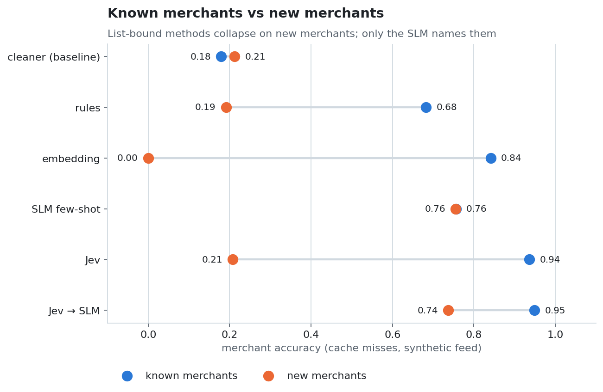
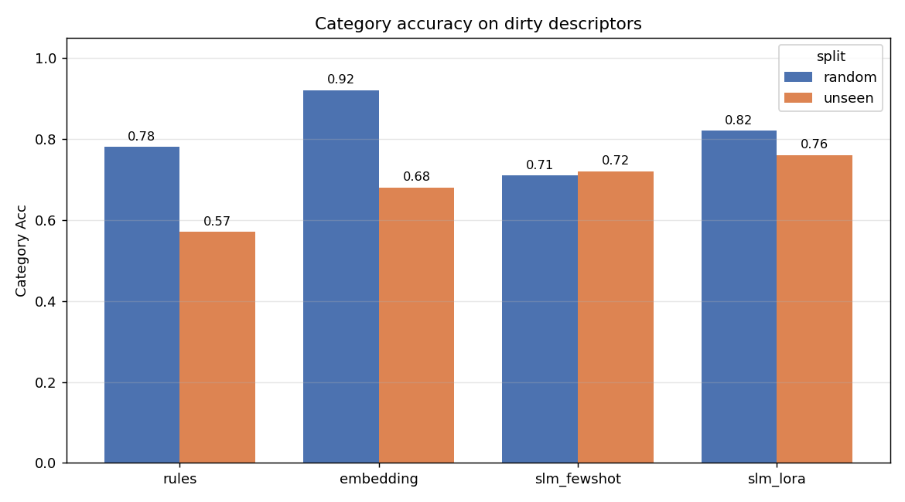
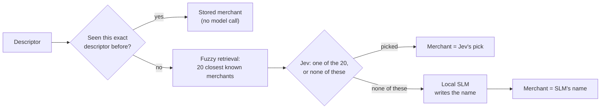
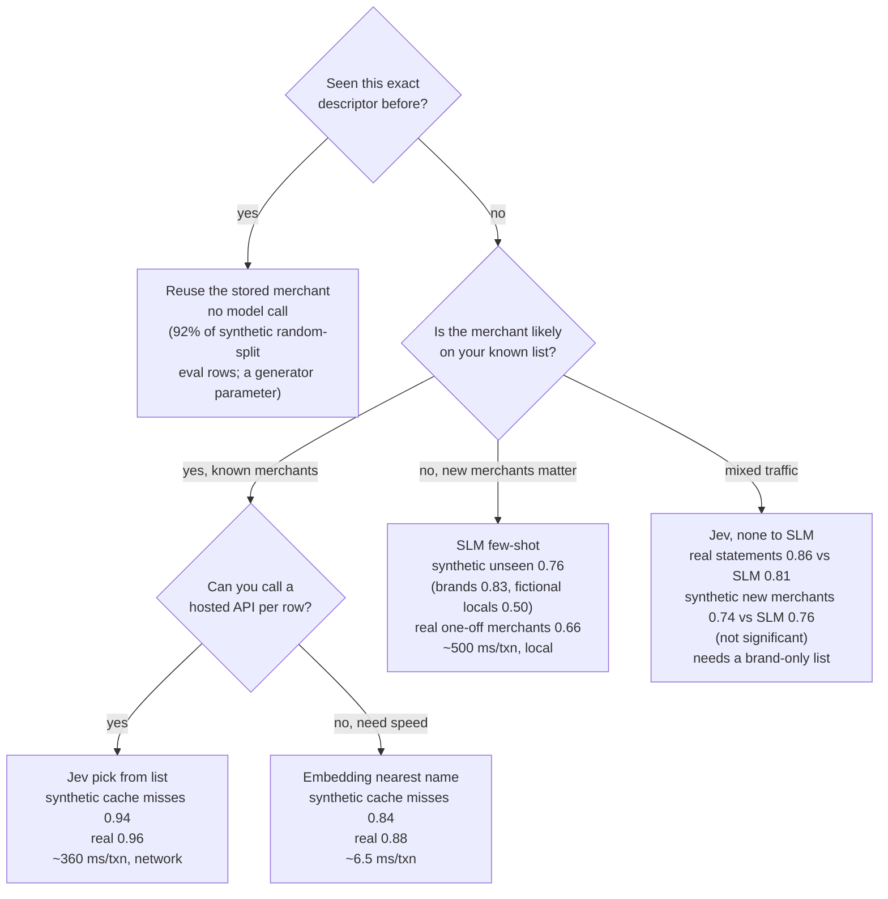
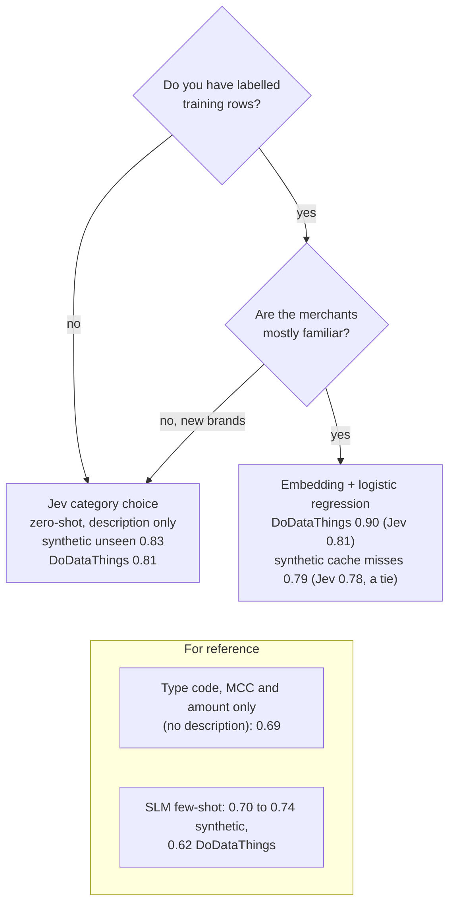

<h1 align="center">Tranx</h1>

<p align="center">
  <b>From noisy bank transaction descriptors to clean merchants and categories</b><br>
  <code>SQ *MCDONALDS F1234 ATLANTA GA</code> &rarr; <b>McDonald's</b> &middot; Food &amp; Dining
</p>

<p align="center">
  
  
  
  
</p>

<p align="center">
  <a href="#1-context">Context</a> &middot;
  <a href="#2-approach">Approach</a> &middot;
  <a href="#3-data">Data</a> &middot;
  <a href="#4-experiment-design-and-process">Experiments</a> &middot;
  <a href="#5-findings">Findings</a> &middot;
  <a href="#6-recommendation">Recommendation</a> &middot;
  <a href="#7-reproduce-and-dig-deeper">Reproduce</a>
</p>

Tranx compares four ways to turn the short, noisy text on a bank statement into a clean
merchant name and a spending category, measures where each works and fails, and derives a
recommended setup from the results.

<p align="center">
  <picture>
    <source media="(prefers-color-scheme: dark)" srcset="reports/figures/overview-dark.png">
    
  </picture>
</p>

> [!TIP]
> **At a glance**
> - **Most rows need no model.** 82% of one person's real debit rows repeat a descriptor
>   seen before, so a descriptor cache comes first.
> - **Known merchants:** Jev picks best from the list, 0.94 on synthetic data and 0.96 on
>   real statements (embeddings 0.84 / 0.88).
> - **New merchants:** only the self-hosted SLM can name them (0.76), and it does far better on
>   national brands (0.83) than on unfamiliar local businesses (0.50).
> - **Category:** Jev without training (0.83 on new brands); embeddings when there are
>   labels from the same source (0.90 vs 0.81).
> - **Jev then SLM** beats the SLM alone on real statements (+0.049, significant) but not
>   on purely new synthetic merchants (-0.018, not significant).

> [!NOTE]
> Every number here comes from a file under `reports/`, produced by one pinned run.
> Supporting tables are in [docs/results.md](docs/results.md).

## 1. Context

### The business problem

Banks and budgeting apps want to show a customer where the money went: "you spent $214 at
McDonald's this year", "groceries are up 12%". They start from the descriptor on each card
or ACH transaction, a short string written for payment systems rather than for people:

| Descriptor on the statement | Merchant | Category |
|---|---|---|
| `SQ *MCDONALDS F1234 ATLANTA GA` | McDonald's | Food & Dining |
| `BP on Buford Hwy` | BP | Transportation |
| `AMZN Mktp UK*MI5TU` | Amazon | Shopping & Retail |
| `SALARY - RUSH HOUR` | (none) | Income |

Each transaction needs a direction (money in or out), a category and a canonical merchant
name, so that spend can be summed per customer per merchant. The merchant is the hard part:

- **Wrappers and noise.** A payment facilitator's name is joined to the seller's with an
  asterisk (`SQ *`, `PP*`), and descriptors carry store numbers, cities and ids.
- **Short fields.** Visa allows 25 characters for the merchant name, so long names are
  abbreviated or cut (`DOUBLETREE BY HILT`); ACH entries carry a company name and a
  10-character entry description.
- **Many spellings of one merchant.** `McDonald's #111` and `MCDONALDS F1234` must land on
  one name, or the customer sees two merchants.
- **New merchants.** Small and local businesses appear constantly; no list is complete.
- **Brands inside brands.** Descriptors carry the name customers recognize, not the legal
  operator, and sub-brands (DoubleTree by Hilton, Uber Eats) raise the question of whether
  spend rolls up to the parent.

A wrong or split merchant name makes the per-merchant totals wrong, and those totals are
what the customer sees.

### How this is usually solved

Teams typically stack some of the following layers. Sources are listed at the end of the
section.

- **Rules, lookup tables and the MCC.** Regular expressions strip noise, a table maps the
  cleaned string to a merchant, and the category comes from the merchant category code
  (MCC), a four-digit ISO 18245 code on every card transaction. This is cheap, fast and
  explainable. But the MCC is assigned by the merchant's bank (the acquirer) to describe
  the merchant's main business by sales volume, not what a given purchase was; one
  merchant can hold several MCCs; codes are sometimes wrong, since their accuracy is not
  needed for the payment to go through [1][2]; and ACH transactions have none.
- **Matching against a merchant reference database.** The descriptor, city, MCC and
  merchant ids are matched, exactly or fuzzily, against a curated list of merchants,
  which gives one identity per merchant across its descriptor variants. Merchant ids do
  not map one-to-one onto businesses, so matching often falls back to name and location
  [2].
- **Supervised classifiers.** A model trained on labelled transactions handles variants
  that rules miss and reaches high accuracy within one data source (91% F1 over 15
  categories in one study [3]). Labels are expensive enough that reducing them is its own
  research topic [4]; the models generalize poorly to another
  institution's data (79% on a random split fell to 48% when tested on an unseen company
  [5]), and new merchants are a cold-start problem [6].
- **Language models.** Prompted zero-shot, a language model agreed with expert labels 80% of
  the time [5]; fine-tuned small models come close to larger ones at extracting merchant
  names [7]. Running a model on every transaction is slow and costly (2-7 s per sample in
  one benchmark [7]), so some pipelines use it offline only [8].
- **Where the model runs matters.** Any hosted model, whether a generative LLM or a
  multiple-choice model such as Jev below, receives the descriptor, which can contain
  personal names; banks weigh this against models they host themselves [5].

### What this project adds

The gaps above are new merchants, dependence on labelled data, and cost and privacy of
models. This project:

- **Measures new merchants directly.** One split holds out whole brand families, and 800
  invented local businesses remove the advantage a language model gets from having read
  about national chains.
- **Scores only what a model would see.** A production system answers repeated
  descriptors from a cache, so the headline scores use descriptors never seen in training.
- **Combines a cheap multiple-choice model with a self-hosted generative one** and measures when
  that combination pays off.
- **Defines "correct" for the product** (parent brands, generic places) and fixes one
  comparison in advance, tested with a paired bootstrap over merchants.
- **Checks synthetic results against real statements** and an independently generated
  dataset, with every run pinned by a manifest.

<details>
<summary><b>Sources</b></summary>

1. [ISO 18245](https://www.iso.org/standard/79450.html) and the
   [Visa Merchant Data Standards Manual](https://usa.visa.com/dam/VCOM/download/merchants/visa-merchant-data-standards-manual.pdf):
   MCC assignment, 25-character name field, facilitator `*` format, DBA name.
2. [Federal Reserve FEDS 2019-057](https://www.federalreserve.gov/econres/feds/files/2019057pap.pdf)
3. [arXiv 2404.08664](https://arxiv.org/abs/2404.08664)
4. [arXiv 2305.18430](https://arxiv.org/abs/2305.18430)
5. [LLMs for transaction categorization, ICAIF workshop](https://www.sea.dev/assets/ICAIF_workshop_paper-llms.pdf)
6. [arXiv 2506.09234](https://arxiv.org/abs/2506.09234)
7. [arXiv 2606.08051](https://arxiv.org/html/2606.08051v1)
8. [arXiv 2601.05271](https://arxiv.org/abs/2601.05271)

ACH field lengths: [Nacha](https://www.nacha.org/rules/risk-management-topics-company-entry-descriptions).

</details>

## 2. Approach

### Methods compared

The methods span the trade-off between cheap methods that can only pick from a known
merchant list and costlier ones that can name any merchant. All share one preprocessing
step: strip a leading payment wrapper (`SQ *`, `TST*`, `PP*`, `PAYPAL *`, `SP *`,
`POS DEBIT`, `PURCHASE`, `ACH`), then drop store and transaction ids, countries, time
phrases and words such as Store or Mall (`tranx/pipeline/clean.py`,
`tranx/synth/canonical.py`). City and state names stay; abbreviation and truncation cannot
be undone. The *known merchant list* is the set of merchant names in the labelled training
data. Direction is the sign of the amount for every method.

| Method | Reads | Returns | Data leaves the bank | Why it works | Where it stops |
|---|---|---|---|---|---|
| `cleaner` (baseline) | description | cleaned text as the merchant | no | removes most noise mechanically | the text is not a canonical name |
| `metadata` (baseline) | type code, MCC, amount | category only | no | the MCC encodes the line of business | no merchant; MCCs are coarse and noisy |
| `rules` | description, MCC | best fuzzy match, else cleaned text; category from MCC or merchant history | no | token-overlap matching tolerates extra words | only known merchants |
| `embedding` | description | nearest known name; category from a classifier | no | similar strings get similar vectors | always answers with a known name; the classifier learns known brands |
| `slm_fewshot` | description | a merchant name it writes; a category | no (self-hosted) | the model has read about brands and knows what words like "cantina" mean | only what the model knows; about 0.5 s per transaction |
| `jev_merchant` | description | one of 20 retrieved candidates or "none of these"; a category | yes (hosted API) | choosing is easier than writing, and each choice has a confidence | only merchants retrieval offered |
| `jev_slm` | description | Jev's pick, else the SLM's name | yes | Jev for known merchants, the SLM for new ones | a wrong Jev pick never reaches the SLM |

<details>
<summary><b>How each method works</b></summary>

**Fuzzy rules (`rules`).** The baseline most pipelines start from. The cleaned description
is compared with each cleaned known name using rapidfuzz `token_set_ratio`, which scores
word overlap and so tolerates extra tokens such as a city; a score of 85 or more returns
that name, otherwise the cleaned text. Category is the most common one for the MCC in
training, else for the matched merchant. Fast and transparent, but a new merchant always
falls back to its cleaned text.

**Sentence embeddings plus a classifier (`embedding`).** The standard machine-learning
route. MiniLM (`all-MiniLM-L6-v2`) turns the cleaned description and every known name into
vectors; the closest name wins, which handles misspellings and fragments. A logistic
regression on the embedding of the raw description gives the category. It needs labelled
data, cannot answer "not on the list", and its category classifier learns the brands it
was trained on.

**A small language model, few-shot (`slm_fewshot`).** The only method that can write a
merchant name nobody gave it, and it runs on infrastructure the bank controls: its own
servers or its own cloud account, so no third party sees the descriptors. A prompt with
instructions, the category names and five worked examples (`SQ *CANES 47486` becomes
Raising Cane's) goes to Qwen2.5-3B-Instruct on a local Ollama server at temperature 0; the
model returns JSON with the merchant and the category, and an unparseable reply falls back
to the cleaned text. It knows what it read during training: famous brands well, unfamiliar
local names much less.

**A hosted multiple-choice model (`jev_merchant`).** TypeSafe's Jev never writes text; it
answers typed questions by choosing among options, and returns a probability per option
and a confidence. Fuzzy retrieval picks the 20 known merchants closest to the description,
and one call asks two questions: which category, and which of the 20 merchants (or "none
of the listed merchants"). Only the description is sent; amount, type code and MCC are
withheld because in the synthetic data they are generated from the category and would
leak the answer. It can only name a merchant retrieval offered, and the description leaves
the bank.

**The combination (`jev_slm`).** Jev picks from the list; a "none of these" answer sends
the description to the SLM, which names the merchant. The category stays Jev's.

**Baselines.** `cleaner` returns the cleaned text as the merchant and shows how much a
method adds beyond string cleanup. `metadata` predicts the category with a logistic
regression on the type code, the MCC (or "none") and the log of the amount, without
reading the description.

</details>

### Routes not taken

**Fine-tuning.** A LoRA fine-tune of the same 3B model on 3,600 labelled examples raised
category accuracy by 0.11 and known-merchant accuracy by 0.06, but new-merchant accuracy
fell from 0.78 to 0.69: training on our merchants narrowed the model toward them and
eroded the general knowledge that makes it useful for merchants it has not seen
([docs/findings/lora-vs-fewshot.md](docs/findings/lora-vs-fewshot.md)). It also needs
labelled data and retraining as the merchant population changes. Because new merchants
are the case that matters, the few-shot model was kept. These numbers come from an
earlier version of the data and are not comparable with the rest of this README.

**Model size.** Among small local models, Qwen2.5-3B beat Gemma-2-2B on merchant accuracy
and was also faster, because it writes fewer tokens around its answer
([docs/findings/slm-model-comparison.md](docs/findings/slm-model-comparison.md)).

## 3. Data

### Sources

| Source | What it is | Labels | Used to test |
|---|---|---|---|
| Synthetic feed | 100k transactions built from the public dataset `mitulshah/transaction-categorization` (sampled across its categories and five countries) | merchant from the clean source text or the invented name; category from the source | all methods, known and new merchants |
| MoneyData | one person's anonymized UK bank statements, 2015-2022 ([Firat et al. 2023](https://github.com/thevisgroup/MoneyVis)); 547 labelled card and direct-debit descriptors covering 3,521 rows | merchant only, drafted by a language model and checked by a second one; not human-verified | merchant methods on real noise |
| DoDataThings v2 | independently generated US descriptors, 17 categories ([Hugging Face](https://huggingface.co/datasets/DoDataThings/us-bank-transaction-categories-v2)) | category only | category methods on noise our generator did not make |

### Processing

The source dataset has clean descriptions and categories but no bank-feed structure, so
the synthetic feed adds it (`tranx/synth/`, settings in `tranx/config.py`):

- **Transaction fields:** 1,500 customers, amounts drawn per category, payment methods, a
  type code, and an MCC on 60% of merchant rows, 15% of which point to a wrong category.
- **Dirty descriptors:** each clean name is uppercased (80% of rows), stripped of
  punctuation (50%), given a store number (50%) and a city (50%, with a state 30%), truncated to
  20-25 characters (50%), prefixed with a payment wrapper (45%), and squeezed together
  (20%).
- **Abbreviation:** 15% of descriptors drop interior vowels (`BLUE HERON BAKERY` becomes
  `BLUE HRN BKRY`).
- **Invented local merchants:** a quarter of merchant rows in eight categories move to 800
  invented names ("Rustic Stag Bookshop", "Kingsbury Physiotherapy") that share no word
  with any real label; 13,152 of 57,791 merchant rows end up local.
- **Repeat visits:** each merchant gets a number of locations that grows with its row
  count, each location has one fixed descriptor, and visits favour a few locations. This
  gives 0.156 distinct descriptors per row; MoneyData has 0.181.

MoneyData uses card (DEB) and direct-debit (DD) rows; an alias table lists legitimate
alternative names. Of 730 labelled descriptors, 15 are not merchants and 168 of the rest
are marked low-confidence; both are excluded, leaving 547. For
DoDataThings, test descriptions that also occur in training are removed.

### Making the labels trustworthy

- **What counts as a merchant.** 42% of synthetic rows have no merchant and are scored for
  category only: transaction types (salary, transfers, fees), things bought rather than
  who was paid (MRI, tolls, broadband), and 79 labels that name a kind of place rather
  than an organization (Pharmacy, Police Department, Hospital, Gym). Summing spend "at
  Pharmacy" would merge unrelated businesses. Named organizations stay merchants (IRS,
  DMV, Post Office, Children's Hospital).
- **Parent brands.** An answer naming the gold merchant's parent counts as correct when
  both are the same kind of business (DoubleTree by Hilton as Hilton), or when the row's
  category was also predicted right (Walmart Pharmacy as Walmart, with a healthcare
  category). MoneyData has no category labels, so there only same-business parents count;
  Uber Eats answered as Uber stays wrong. The list is `PARENT_BRANDS` in `tranx/config.py`.
- **Label audits.** Template words that split one brand into several labels ("Starbucks
  Downtown") were stripped, duplicates merged (Cane's into Raising Cane's), and one label
  that meant two companies split by category (Frontier Airlines, Frontier Communications).
- **Leaks removed.** The synthetic type code no longer encodes the category; Jev is not
  shown amount, type code or MCC; descriptors that map to two different merchants are
  dropped from scoring.
- **Circular scores flagged.** The synthetic merchant label is derived from the clean
  source text with the same cleaning rules the `cleaner` uses, so a method that falls back
  to cleaned text can score without understanding anything. The `cleaner` baseline is
  reported next to every method to expose this.
- **Real labels checked twice.** MoneyData labels were drafted by one model, audited by a
  second, and backed by the alias table.

### Limitations of the data

> [!WARNING]
> - **One real person.** The only real merchant data is one person's UK statements; the
>   results say nothing reliable about other customers, countries or banks.
> - **Labels from models.** MoneyData labels are not human-verified, and dropping the
>   low-confidence ones leaves the easier descriptors.
> - **Synthetic by construction.** The local-merchant share, abbreviation rate, repeat
>   structure and MCC noise are settings, not measurements. Invented names test reading an
>   unfamiliar name, not knowledge of real local businesses.
> - **Shared vocabulary.** The cleaner and the generator share the list of payment wrappers,
>   so the synthetic feed is kinder to string cleaning than real statements are.
> - **No multi-customer real data.** How often a bank sees a new descriptor cannot be
>   measured here.

## 4. Experiment design and process

**Two questions, two splits.** The *random* split shares merchants between training and
evaluation (known merchants). The *unseen* split holds out whole brand families, so no
evaluated brand or its siblings appear in training (new merchants; 213 merchants, most of
them invented locals). On MoneyData the equivalent is a realistic list: merchants seen in
two or more descriptors are on it, and the 202 seen once are new.

**Scoring what a model would see.** Evaluation rows whose descriptor already appears in
training would be answered by a cache, so the headline scores use only the remaining
descriptors, one row each: 1,483 on the random split (91.8% of rows were cache hits) and
2,665 on the unseen split. A second view scores all rows with a perfect cache in front
([docs/results.md](docs/results.md#1-synthetic-feed-all-methods)).

**Metrics.** Merchant accuracy is a match after ignoring case and punctuation, with the
parent-brand rule above. Category accuracy is exact. On MoneyData, accuracy is also
reported per row, per merchant and weighted by spend.

**Significance.** The primary comparison, fixed in advance, is the combination (`jev_slm`)
against the SLM alone on new merchants, on the synthetic unseen split and on MoneyData.
Both methods are scored on the same rows, and whole merchants are resampled 4,000 times,
because rows of one merchant are not independent. All other comparisons are exploratory.

**Process.** One full run scores all seven methods on both splits (about 1.5 hours on a
laptop, under $1 of API use). Follow-up analyses reuse the saved predictions without new
model calls: confidence thresholds for Jev, an embedding-similarity gate, and routing the
category by Jev's merchant answer. Label rules were revised once after a run and
everything was rerun: treating generic places as merchants had put entries like "Pharmacy"
on Jev's list, where they attracted new merchants. With them removed, Jev filed 3.6% of
new merchants under a known name instead of 6.5%, and the primary synthetic difference
moved from -0.041 (significant) to -0.018 (not significant; earlier figures in
`reports/significance.md` at commit 7a630ff). The merchant list's hygiene matters as much
as the model.

## 5. Findings

### Most transactions never need a model

In one person's statements, 730 distinct descriptors cover 4,043 debit rows: 18% of rows
carry a descriptor not seen before, and a descriptor cache answers the rest. The rate of
new descriptors per year ranged from 10.5% to 24.8% (`reports/cache_sim.json`). Models
matter for the misses, which is where all synthetic scores below are measured.

### Known merchants: Jev picks best from the list

| Method | synthetic, known merchants | MoneyData, every merchant on the list |
|---|---|---|
| cleaner | 0.18 | 0.18 |
| rules / fuzzy | 0.68 | 0.87 |
| embedding | 0.84 | 0.88 |
| slm_fewshot | 0.76 | 0.81 |
| **jev_merchant** | **0.94** | **0.96** |

Jev beats embeddings by +0.095 (95% CI +0.068 to +0.122) on synthetic data and +0.080
(+0.014 to +0.126) on MoneyData. The right merchant was among Jev's 20 candidates for 95%
of these rows.

<p align="center">
  <picture>
    <source media="(prefers-color-scheme: dark)" srcset="reports/figures/merchant_norm-dark.png">
    
  </picture>
</p>

On real statements the ranking holds per descriptor. Weighting by spend lowers every
method, because a single investment transfer carries 19% of debit spend and no method
names it; without it the scores return close to the per-descriptor ones.

<p align="center">
  <picture>
    <source media="(prefers-color-scheme: dark)" srcset="reports/figures/moneydata-dark.png">
    
  </picture>
</p>

### New merchants: only the SLM can name them, and mostly the famous ones

On brand-disjoint synthetic merchants the SLM scores 0.76; list-bound methods score at or
below plain cleaning (0.21), and embeddings score 0 because they can only return a known
name. The SLM's accuracy depends on what it already knows: 0.83 on national brands, 0.50
on invented local names, 0.19 when the name is abbreviated. On MoneyData's one-off
merchants it scores 0.66.

### Category: Jev without training, embeddings with in-domain labels

| Method | synthetic, known brands | synthetic, new brands | DoDataThings |
|---|---|---|---|
| metadata only | 0.69 | 0.69 | - |
| embedding + classifier | **0.79** | 0.55 | **0.90** |
| slm_fewshot | 0.70 | 0.74 | 0.62 |
| Jev | 0.78 | **0.83** | 0.81 |

On new brands the embedding classifier (0.55) falls below the metadata baseline; it
learned the brands it was trained on rather than what the words mean. Jev reads the words
(0.83). With labels from the same data source, embeddings win (0.90 vs 0.81 on
DoDataThings). Switching between the two row by row, using Jev's merchant answer, does not
beat Jev alone ([docs/results.md](docs/results.md#7-routing-the-category-by-jevs-merchant-answer)).

<p align="center">
  <picture>
    <source media="(prefers-color-scheme: dark)" srcset="reports/figures/category-dark.png">
    
  </picture>
</p>

### Combining Jev and the SLM: helps on real data, not on synthetic new merchants

| Primary comparison: `jev_slm` minus SLM alone | difference | 95% CI |
|---|---|---|
| MoneyData, realistic list | +0.049 | +0.019 to +0.101 |
| synthetic, new merchants | -0.018 | -0.045 to +0.001 |

On real statements, where most traffic is known merchants, the combination is better. On
purely new synthetic merchants it is no better: Jev answers "none of these" for 96.4% of
them, and the 3.6% it files under a known name are mostly look-alikes (Marshals for
Marshalls, Mount Sinai for Cedars-Sinai) that never reach the SLM. A confidence threshold
on Jev's pick recovers that small gap but costs accuracy on known merchants
([docs/results.md](docs/results.md#4-jev-as-a-new-merchant-detector)).

<p align="center">
  <picture>
    <source media="(prefers-color-scheme: dark)" srcset="reports/figures/significance-dark.png">
    
  </picture>
</p>

## 6. Recommendation

### Setup



1. **Cache exact descriptors first;** most rows never reach a model.
2. **Known merchants: Jev over a brand-only list** (0.94 synthetic, 0.96 real).
3. **New merchants: the self-hosted SLM** names them; unfamiliar local businesses are much
   harder (0.50) than national brands (0.83).
4. **Category: Jev** when there is no in-domain labelled data or brands are new; an
   embedding classifier trained on the bank's own labels when there is.
5. **Keep the merchant list clean.** Generic entries and look-alike names are where Jev's
   "none of these" fails.

> [!IMPORTANT]
> **If descriptors may not go to a third party,** replace Jev with self-hosted methods:
> embeddings for known merchants (0.84 synthetic, 0.88 real, about 6.5 ms per transaction)
> and the SLM for new ones. The cost is accuracy on known merchants (0.96 to 0.88 on real
> statements) and the loss of a "none of these" signal; the embedding similarity is a weak
> substitute (on MoneyData a 0.7 threshold sends 67% of descriptors on to the SLM).

<details open>
<summary><b>Decision tree: merchant</b></summary>



</details>

<details>
<summary><b>Decision tree: category</b></summary>



</details>

### Cost at bank scale (a scenario, not a measurement)

**Per call.** Jev costs about $0.000027 per transaction (641 input tokens measured in this
run, at $42 per billion input tokens; output is free, per typesafe.ai). The SLM prompt is
317 input and 19 output tokens on average (`reports/slm_throughput.json`). Priced as a
hosted model (Claude Haiku 4.5, used here only as a price reference; its accuracy on this
task was not measured), one call costs about $0.00021 on the Batch API, 7.7 times Jev, or
$0.00041 in real time, 15 times Jev.

**Self-hosted SLM.** Run on the bank's own servers or cloud account, the SLM is paid for
in machine time: cost per transaction is the instance's hourly price divided by the
requests it serves per hour. Cloud throughput was not measured here, and no provider
publishes a figure for a 3B model on requests this short, so the table below is an
estimate. It takes the prompt-processing throughput Microsoft and NVIDIA report for an 8B
model on cloud GPUs, scales it to 3B by compute (94% of this workload's compute is reading
the 317-token prompt), and gives a low-high range; prices are on-demand, US East, read
2026-09-29 from the AWS price list.

| Instance (GPU) | $ per hour | Estimated requests per second | $ per 1,000 requests at full load |
|---|---|---|---|
| g6.xlarge (L4) | 0.80 | 10-25 | 0.009-0.022 |
| g6e.xlarge (L40S) | 1.86 | 30-90 | 0.006-0.017 |
| p5.4xlarge (H100) | 6.88 | 60-180 | 0.011-0.032 |

At full load a self-hosted call costs about $0.000006-0.00003, the same order as Jev and
6 to 35 times below the hosted Batch price. Instances bill by the hour whether busy or
not: at 30% average use, multiply by about 3.3. Sources and the derivation are in
[docs/results.md](docs/results.md#10-self-hosted-slm-cost-estimate); a one-hour benchmark on a
g6.xlarge (under $1) would replace the estimate with a measurement.

**At bank scale.** For a large US regional bank at about 5 million card and ACH
transactions a day (an estimate: Regions reported about 700 million debit card
transactions in 2010, and US debit volume roughly tripled to 120.6 billion in 2024 per the
Federal Reserve Payments Study), with the SLM tier priced at the hosted Batch rate:

| Setup | per day | per year |
|---|---|---|
| Every transaction through Jev | $135 | $49k |
| Jev then hosted SLM (Batch rate), no cache | $510 | $186k |
| Same, 20% cache misses | $102 | $37k |
| Same, 5% cache misses | $26 | $9k |
| Jev then self-hosted SLM on 1-3 g6.xlarge, no cache | $154-193 | $56k-70k |

The SLM share is 36.4% of misses (MoneyData realistic list); without a cache that is about
1.8 million SLM calls a day, which the throughput estimate above puts at one to three L4
instances running around the clock, assuming load spread evenly over the day. At this
scale the model bill is small
next to the cost of keeping the merchant list clean, labelling, and the review of whether
descriptors, which can contain personal names, may be sent to an external service.

## 7. Reproduce and dig deeper

```bash
python3.11 -m venv .venv && source .venv/bin/activate
pip install -r requirements.txt
huggingface-cli login              # accept the dataset terms on its HF page first
ollama pull qwen2.5:3b-instruct
./run.sh                           # tests, synthetic feed, all methods; TRANX_N=5000 for a quick pass
```

`run.sh` scores the local methods into `reports/leaderboard_hard.md`; with
`TYPESAFE_API_KEY` set (or the key in the macOS keychain under `jev-api-key`) it also
scores the Jev methods into `reports/leaderboard_hard_jev.md`. A full run takes about 1.5
hours on a laptop.

`eval` writes `reports/run/manifest.json` (hashes of the data, prompt and candidate lists,
and the exact evaluation rows) and per-row predictions under `reports/preds/`. The
analysis scripts read those predictions and refuse any file scored against a different
manifest.

<details>
<summary><b>Analysis scripts</b> (run from the repository root with <code>PYTHONPATH=.</code>)</summary>

| Script | What it produces |
|---|---|
| `scripts/significance.py` | paired bootstrap tests, `reports/significance.md` |
| `scripts/category_routing.py` | the category routing experiment |
| `scripts/jev_confidence.py --synthetic-only` | Jev's confidence and "none of these" behaviour |
| `scripts/jev_threshold_cascade.py --synthetic-only` | cascade accuracy at confidence thresholds |
| `scripts/cache_sim.py` | how often a descriptor is new |
| `scripts/slm_throughput.py` | SLM requests per second at 1-8 concurrent requests, and its token counts |
| `scripts/make_figures.py` | every figure, light and dark |
| `scripts/eval_moneydata.py --methods ""` | MoneyData scores from saved predictions (without the flag it calls the models again) |
| `scripts/eval_ddt.py` | DoDataThings category scores |

MoneyData's raw file, labels and aliases are kept locally under `data/real/` and are not in
this repository, because the source carries no licence and the labels are unverified.

</details>

Further reading:

- [docs/results.md](docs/results.md): full tables for both evaluation views, subsets by
  merchant origin and noise, all significance tests, Jev's confidence and threshold sweep,
  MoneyData per row, per merchant and by spend, DoDataThings, category routing, cache
  rates.
- [docs/findings/](docs/findings/): earlier findings (fine-tuning, model size, first
  hard-mode results), kept as history; their numbers predate the current labels.
